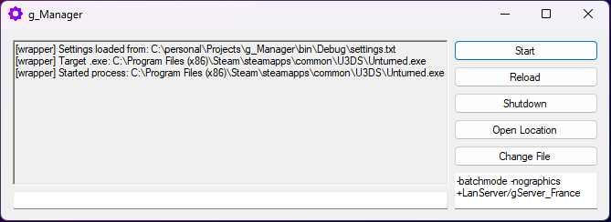

# g_Manager

A lightweight Unturned dedicated server console application wrapper designed for easier management and control.

Simple, efficient, and straightforward.

---

## Star Goal

If g_Manager reaches **2 GitHub stars**, I will prioritize working on quality updates and new features.

If you find the project useful, consider giving it a star. It helps show that there is interest in continued development.

---

## Visual Showcase

  

---

## Download

No coding or build setup is required if you only want to use the application.

Download the latest executable from the [Releases](../../releases) page.

---

## Quick Start

1. Download the latest release.
2. Run the application.
3. Configure your Unturned server settings.
4. Start managing your server with ease.

---

## Features

* **Simple Interface** Straightforward console wrapper without unnecessary complexity.
* **Lightweight** Minimal resource usage and fast startup.
* **Easy Configuration** Intuitive settings for server management.
* **Real-time Server Control** Direct access to server console commands.
* **Stable Release** Fully functional and production-ready.

---

## Requirements for Running the App

These are the only requirements if you download the executable from the Releases page.

* Windows (XP or later)
* .NET Framework 4.7.2 or later

You do **not** need Visual Studio or development tools if you are only downloading and running the release build.

---

## Building from Source

These steps are only needed if you want to modify the code or build the application yourself.

### Build Requirements

* Visual Studio 2022
* .NET Framework 4.7.2 Developer Pack
* Windows SDK (recommended)

---

### Steps to Build

1. Open `g_Manager.sln` or the project file in Visual Studio 2022.
2. Restore NuGet packages if needed.
3. Build the solution in **Debug** or **Release** configuration.
4. The executable will be available in the `bin/Release/` or `bin/Debug/` folder.

---

## Project Status

g_Manager is a stable release. The application is fully functional and suitable for production use.

Future improvements may include:

* Enhanced UI/UX
* Additional server management features
* Performance optimizations
* Extended configuration options

---

## License

This project is licensed under the **Apache License 2.0**. See [LICENSE](LICENSE) for details.